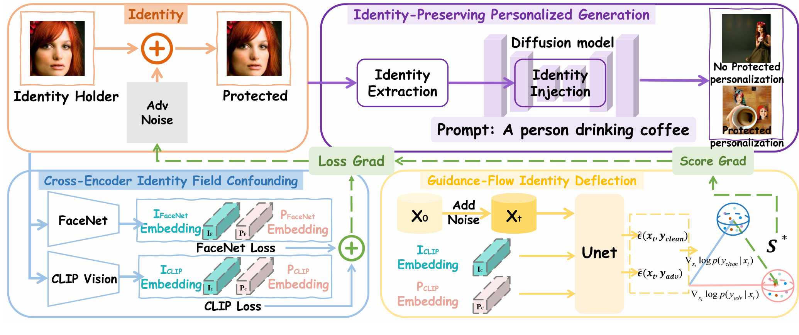

<div align="center">

# IDGuardian

<hr />

### No Way To Steal My Face: Proactive Defense Against Identity-Preserving Personalized Generation

[](https://openaccess.thecvf.com/content/CVPR2026/html/Xiong_No_Way_To_Steal_My_Face_Proactive_Defense_Against_Identity-Preserving_CVPR_2026_paper.html)
[](https://www.python.org/)
[](https://pytorch.org/)
[](https://github.com/huggingface/diffusers)

<p>
  <a href="https://openaccess.thecvf.com/content/CVPR2026/html/Xiong_No_Way_To_Steal_My_Face_Proactive_Defense_Against_Identity-Preserving_CVPR_2026_paper.html"><strong>📄 Open Access Paper</strong></a>
  &nbsp;&nbsp;·&nbsp;&nbsp;
  <a href="https://github.com/OpenAscent-L/IDGuardian"><strong>💻 Code</strong></a>
</p>

<p><strong>Accepted to CVPR 2026</strong></p>

<p>Lizhi Xiong · Jun Li · Ziqiang Li · Weiwei Jiang · Zhangjie Fu</p>

</div>

<p align="center">
  
</p>

## 📌 Overview

IDGuardian protects a reference image before it is shared with an identity-preserving image generator. It optimizes an imperceptible perturbation with the two complementary signals defined in the paper:

- **Cross-Encoder Identity Field Confounding:** minimize clean/protected cosine similarity in CLIP and FaceNet feature spaces.
- **Guidance-Flow Identity Deflection:** compare IP-Adapter SDXL Plus Face denoising predictions under clean and protected identity conditions, then use their score difference as the second update direction.

The released code is the optimization implementation. Downstream personalization generation and identity evaluation can be run with the corresponding target pipeline.

## 🧩 Method-to-code mapping

| Paper component | Implementation |
|---|---|
| Surrogate | IP-Adapter SDXL Plus Face with SDXL base |
| Identity extraction loss | CLIP image embedding + FaceNet cosine similarity |
| Identity injection condition | 16 projected IP-Adapter image tokens concatenated with SDXL text tokens |
| Score bridge | `-(noise_pred_protected - noise_pred_clean) / sqrt(1 - alpha_bar_t)` |
| Update | Normalize identity gradient, subtract normalized score direction, sign-PGD, L-infinity projection |
| Default setting | `epsilon = 8/255`, `alpha = 0.005`, `N_iter = 200` |

## ⚙️ Installation

```bash
conda create -n IDGuardian python=3.10 -y
conda activate IDGuardian
pip install -r requirements.txt
```

## 📦 Download model weights

Large checkpoints are not committed to Git. Download the official IP-Adapter weights:

The tracked `checkpoints/` directory is reserved for model weights. The following command downloads the required files into `checkpoints/ip_adapter/`.

```bash
mkdir -p checkpoints/ip_adapter

hf download h94/IP-Adapter \\
  --include "models/image_encoder/*" \\
  --include "sdxl_models/ip-adapter-plus-face_sdxl_vit-h.bin" \\
  --local-dir checkpoints/ip_adapter
```

The command creates the paths expected by the training script:

```text
checkpoints/ip_adapter/models/image_encoder
checkpoints/ip_adapter/sdxl_models/ip-adapter-plus-face_sdxl_vit-h.bin
```

The SDXL base model is loaded from `stabilityai/stable-diffusion-xl-base-1.0`. For offline use, download it first and pass its local directory to `--pretrained-model-name-or-path`.

The FaceNet checkpoint is loaded through `facenet-pytorch` with `InceptionResnetV1(pretrained="vggface2")`, corresponding to the Inception-ResNet-v1 VGGFace2 checkpoint used for the FaceNet loss.

## 🚀 Run

Main 224 x 224 setting:

```bash
python scripts/IDGuardian_train.py \\
  --input path/to/image_or_directory \\
  --output-dir output/IDGuardian_224 \\
  --image-size 224
```

512 x 512 cross-dataset setting:

```bash
python scripts/IDGuardian_train.py \\
  --input path/to/image_or_directory \\
  --output-dir output/IDGuardian_512 \\
  --image-size 512
```

The default optimization configuration follows the paper: prompt `A photo of a person`, `epsilon = 8/255`, `alpha = 0.005`, and `200` PGD steps. The optimized image is projected into the L-infinity ball and saved under `--output-dir`; `results.jsonl` records the output path and PSNR.

## 📊 Evaluation

Identity similarity evaluation uses the [DeepFace](https://github.com/serengil/deepface) toolkit, following the paper's ArcFace, FaceNet, and VGG-Face evaluation protocol. DeepFace is listed as an evaluation dependency; the training entry point does not run evaluation automatically.

## 📁 Repository structure

```text
.
├── assets/IDGuardian_framework.png
├── checkpoints/
│   └── .gitkeep
├── IDGuardian/
│   ├── attention_processor.py
│   ├── ip_adapter.py
│   ├── resampler.py
│   └── utils.py
├── scripts/IDGuardian_train.py
├── requirements.txt
└── README.md
```

## 📝 Citation

```bibtex
@InProceedings{Xiong_2026_CVPR,
    author    = {Xiong, Lizhi and Li, Jun and Li, Ziqiang and Jiang, Weiwei and Fu, Zhangjie},
    title     = {No Way To Steal My Face: Proactive Defense Against Identity-Preserving Personalized Generation},
    booktitle = {Proceedings of the IEEE/CVF Conference on Computer Vision and Pattern Recognition (CVPR)},
    month     = {June},
    year      = {2026},
    pages     = {20680-20690}
}
```
